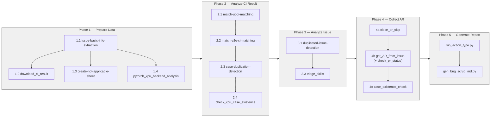

# Bug Scrub Workflow Diagram

Visual reference for the 5-phase torch-xpu-ops bug-scrub pipeline, showing how
each skill consumes and produces data in the shared Excel workbook
(`result/torch_xpu_ops_issues.xlsx`) and supporting artifact folders.

Source of truth for phase semantics: [`SKILL.md`](./SKILL.md) (v3.3).

---

## 1. End-to-End Pipeline

```mermaid
flowchart TD
    %% ========== EXTERNAL INPUTS ==========
    GH[(GitHub API<br/>intel/torch-xpu-ops)]:::ext
    CI[(CI artifacts<br/>torch-xpu-ops + stock pytorch)]:::ext
    PT[(pytorch/pytorch repo)]:::ext

    %% ========== PHASE 1: PREPARE DATA ==========
    subgraph P1["Phase 1 — Prepare Data"]
        direction TB
        S11["1.1 issue-basic-info-extraction<br/><i>fetch + parse issues</i>"]:::skill
        S12["1.2 download_ci_result<br/><i>download CI artifacts</i>"]:::skill
        S13["1.3 create-not-applicable-sheet<br/><i>wontfix / not_target filter</i>"]:::skill
        S14["1.4 pytorch_xpu_backend_analysis<br/><i>operator impl deep-dive</i>"]:::skill
    end

    %% ========== PHASE 2: ANALYZE CI RESULT ==========
    subgraph P2["Phase 2 — Analyze CI Result"]
        direction TB
        S21["2.1 match-ut-ci-matching"]:::skill
        S22["2.2 match-e2e-ci-matching"]:::skill
        S23["2.3 case-duplication-detection"]:::skill
        S24["2.4 check_xpu_case_existence<br/><i>first blank case per issue</i>"]:::skill
    end

    %% ========== PHASE 3: ANALYZE ISSUE ==========
    subgraph P3["Phase 3 — Analyze Issue"]
        direction TB
        S31["3.1 duplicated-issue-detection"]:::skill
        S33["3.3 triage_skills<br/><i>one-by-one deep triage</i>"]:::skill
    end

    %% ========== PHASE 4: COLLECT AR ==========
    subgraph P4["Phase 4 — Collect AR"]
        direction TB
        S4a["4a close_or_skip<br/><i>RULE 1: Fixed → Close<br/>RULE 2: not_target/wontfix → Skip</i>"]:::skill
        S4b["4b get_AR_from_issue<br/>(+ check_pr_status)"]:::skill
        S4c["4c case_existence_check"]:::skill
    end

    %% ========== PHASE 5: GENERATE REPORT ==========
    subgraph P5["Phase 5 — Generate Report"]
        direction TB
        S51["run_action_type.py<br/><i>classify action_TBD → action_Type</i>"]:::script
        S52["gen_bug_scrub_md.py<br/><i>render markdown</i>"]:::script
    end

    %% ========== ARTIFACTS ==========
    XLSX[(result/torch_xpu_ops_issues.xlsx<br/><b>Issues</b> · Test Cases · E2E · Not Applicable)]:::art
    CIART[(ci_results/)]:::art
    BACK[(pytorch_xpu_backend_analysis.md)]:::art
    REPORT[(result/bug_scrub.md<br/>result/bug_scrub_ut.md<br/>result/details/{id}.md × N)]:::out

    %% ========== FLOWS ==========
    GH --> S11
    CI --> S12
    PT --> S14

    S11 -->|"Issues · Test Cases · E2E sheets"| XLSX
    S12 --> CIART
    S13 -->|"+ Not Applicable sheet"| XLSX
    S14 --> BACK

    XLSX --> S21
    CIART --> S21
    S21 -->|"+ XPU Status · Stock Status"| XLSX

    XLSX --> S22
    CIART --> S22
    S22 -->|"+ E2E statuses"| XLSX

    XLSX --> S23
    S23 -->|"+ duplicate_group_id"| XLSX

    XLSX --> S24
    S24 -->|"+ xpu_case_existence<br/>+ case_existence_comments"| XLSX

    XLSX --> S31
    S31 -->|"+ duplicated_issue"| XLSX

    XLSX --> S33
    BACK -.reference.-> S33
    S33 -->|"+ Category · Priority<br/>+ Dependency<br/>+ Root Cause · Fix Approach"| XLSX

    XLSX --> S4a
    S4a -->|"+ action_TBD (close/skip)<br/>+ action_reason<br/>+ owner_transferred"| XLSX

    XLSX --> S4b
    GH -.PR status.-> S4b
    S4b -->|"append action_TBD<br/>append action_reason<br/>append owner_transferred"| XLSX

    XLSX --> S4c
    S4c -->|"append 'check_case_avaliablity'<br/>append case_existence_comments"| XLSX

    XLSX --> S51
    S51 -->|"+ action_Type (17-leaf taxonomy)"| XLSX

    XLSX --> S52
    S52 --> REPORT

    %% ========== STYLES ==========
    classDef ext fill:#f4e8d8,stroke:#8b6f47,stroke-width:2px,color:#000
    classDef skill fill:#d8e8f4,stroke:#2c5f8a,stroke-width:1px,color:#000
    classDef script fill:#e8d8f4,stroke:#5a2c8a,stroke-width:1px,color:#000
    classDef art fill:#fff4d8,stroke:#8a7c2c,stroke-width:1px,color:#000
    classDef out fill:#d8f4d8,stroke:#2c8a2c,stroke-width:2px,color:#000
```

**Legend**

| Shape / Color | Meaning |
|---|---|
| 🟤 Cylinder (tan) | External data source (GitHub API, CI system, pytorch repo) |
| 🟦 Rectangle (blue) | Skill (LLM-driven, `SKILL.md`-governed) |
| 🟪 Rectangle (purple) | Deterministic Python script |
| 🟨 Cylinder (yellow) | Intermediate artifact (Excel, CI dumps, analysis doc) |
| 🟩 Cylinder (green) | Final deliverable (markdown report) |
| Solid arrow | Read / write |
| Dashed arrow (`-.label.->`) | Referenced only (no mutation) |
| Edge label | Column(s) added or data passed |

---

## 2. Skill → Column Matrix

Each skill's contract, in the order the columns appear in the Excel:

| Phase | Skill | Reads | Writes (Issues sheet) | Writes (Test Cases sheet) |
|---|---|---|---|---|
| 1.1 | issue-basic-info-extraction | GitHub API | Issue ID, Title, Status, Assignee, Reporter, Labels, Created Time, Body | Test Case, Test File, Error Message, Traceback |
| 1.2 | download_ci_result | CI artifacts URL | — (produces `ci_results/`) | — |
| 1.3 | create-not-applicable-sheet | Issue labels | *(writes "Not Applicable" sheet)* | — |
| 1.4 | pytorch_xpu_backend_analysis | pytorch repo | — (produces standalone .md) | — |
| 2.1 | match-ut-ci-matching | Test Cases, CI artifacts | — | XPU Status, Stock Status |
| 2.2 | match-e2e-ci-matching | E2E Test Cases, CI artifacts | — | *(E2E sheet)* XPU Status, Stock Status |
| 2.3 | case-duplication-detection | Test Cases | — | duplicate_group_id |
| 2.4 | check_xpu_case_existence | Test Cases (first blank row per issue) | — | xpu_case_existence, case_existence_comments |
| 3.1 | duplicated-issue-detection | Issues, Test Cases | duplicated_issue | — |
| 3.3 | triage_skills | Issues body, Test Cases, pytorch_xpu_backend_analysis | Category, Priority, Dependency, Root Cause, Fix Approach | — |
| 4a | close_or_skip | Labels, Test Cases statuses | action_TBD, action_reason, owner_transferred | — |
| 4b | get_AR_from_issue | Issues body, GitHub PRs (gh api) | action_TBD *(append)*, action_reason *(append)*, owner_transferred *(append)* | — |
| 4c | case_existence_check | xpu_case_existence, case_existence_comments | action_TBD *(append `check_case_avaliablity`)*, action_reason *(append)* | — |
| 5 (script) | `run_action_type.py` | action_TBD | action_Type *(17-leaf taxonomy, `+`-joined)* | — |
| 5 (script) | `gen_bug_scrub_md.py` | Issues sheet | — (produces `bug_scrub.md`, `bug_scrub_ut.md`, `details/*.md`) | — |

---

## 3. Execution Order & Dependencies



**Invariants**

- Phases are strictly sequential; later phases append columns to the shared Excel.
- Within a phase, sub-steps labeled N.1 → N.2 → N.3 → N.4 are also strictly sequential.
- Phase 4 sub-steps 4a → 4b → 4c are sequential because each may **append** to `action_TBD` / `action_reason`.
- Phase 5's two scripts are sequential: `action_Type` must exist before rendering.

---

## 4. Output Artifacts

```
result/
├── torch_xpu_ops_issues.xlsx          ← single source of truth, grown phase-by-phase
├── torch_xpu_ops_issues_bk_*.xlsx     ← step-by-step backups (convention)
├── pytorch_xpu_backend_analysis.md    ← from 1.4
├── bug_scrub.md                       ← from 5, full scope (all issues)
├── bug_scrub_ut.md                    ← from 5, UT-scoped subset
└── details/
    └── {issue_id}.md × N              ← from 5, one per issue
ci_results/                            ← from 1.2, per-run artifacts
```

---

## Version

v1.0 — 2026-04-22 — initial workflow diagram accompanying bug_scrub SKILL.md v3.3.
